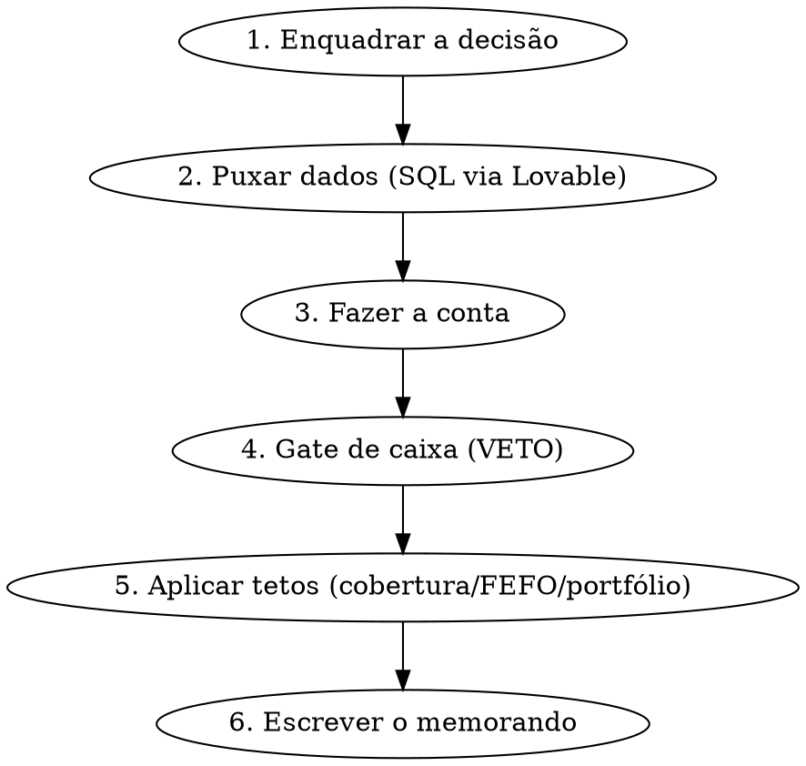

# Reposição & Caixa — Memorando de Decisão de Compra (Oben)

## O que esta skill é (e o que não é)

Esta skill ajuda o dono/comprador da **Oben** (distribuidora que **compra e revende** para
indústria moveleira) a decidir uma compra de reposição **conectando duas coisas que o app
hoje trata em módulos separados**: a lógica de quanto/quando comprar (reposição) e o
**impacto no caixa / capital de giro** (financeiro). Esse vão é a razão de existir da skill.

O sistema já calcula, no Postgres, ponto de pedido, estoque mínimo, EOQ (modelo
Silver-Pyke-Peterson), curva ABC/XYZ, demanda e lead time. **A skill não recalcula isso** —
ela lê esses números, soma a camada de caixa que ninguém soma, e devolve um **memorando**.

A saída é um **MEMORANDO de decisão**, não uma automação. A skill **não escreve no banco**,
não dispara pedido, não aprova nada. Ela recomenda; você decide.

### Fato de negócio que muda tudo (confirmado pelo dono)
A Oben paga **a maioria dos fornecedores à vista** (muitas vezes com desconto à vista).
Logo a compra **sai do caixa quase imediatamente** — o caixa é a restrição que manda.
Por isso o **gate de caixa é o veto #1**: uma compra economicamente atraente que cria uma
semana de caixa fraca deve ser **rejeitada ou redimensionada**, não aprovada.

## Restrição operacional inviolável: acesso ao banco só via Lovable

O Lucas **não tem terminal/CLI/psql/curl** para o banco. Todo dado vem do **SQL Editor
dentro do Lovable** (read-only). Portanto:

- **NUNCA** tente rodar SQL você mesmo (sem `psql`, `curl`, `supabase` CLI). Não há acesso.
- O fluxo é: a skill **gera a query**, o usuário roda em **🟣 Lovable → SQL Editor → cola → Run**,
  e **cola o resultado de volta** no chat. A skill interpreta e monta o memo.
- Rotule toda query assim: `🟣 Lovable → SQL Editor → cola → Run`.
- As queries de apoio estão em [`references/sql-queries.md`](references/sql-queries.md). Os nomes de
  coluna foram inferidos do schema; se uma coluna não existir, peça ao usuário a lista de
  colunas da tabela (`SELECT * ... LIMIT 1`) e ajuste — não invente.

## Fluxo (siga em ordem)



### 1. Enquadrar a decisão
Antes de puxar dado, classifique em qual dos três casos você está — cada um usa um conjunto
de dados e uma conta diferente:

| Caso | Gatilho típico | Pergunta central |
|------|----------------|------------------|
| **A. Reposição de rotina** | "preciso comprar X?", estoque baixo, ponto de pedido | Comprar agora, segurar, ou reduzir lote? Cabe no caixa? |
| **B. Antecipar aumento** | "fornecedor anunciou +X%", "vale comprar antes?" | O aumento evitado paga o custo de carregar o estoque extra? |
| **C. Promoção / volume** | "tem promoção", "desconto por volume", "vale pegar mais?" | O desconto paga o custo de capital do estoque extra, sem furar o caixa? |

Se o usuário não disse o SKU/fornecedor, pergunte. Se ele só disse "o que devo comprar hoje",
comece pela **lista de oportunidades** (Query 3) e pela **folga de caixa** (Query 2).

### 2. Puxar os dados
Use as queries de [`references/sql-queries.md`](references/sql-queries.md). Mínimo por caso:
- **Sempre**: Query 1 (painel do SKU: estoque, parâmetros, classe, custo, lead time) +
  Query 2 (folga de caixa 13 semanas) + Query 6 (caixa hoje).
- **Caso B**: + Query 4 (aumento vigente no SKU).
- **Caso C**: + Query 5 (avaliação da promoção).
- **Sanidade**: Query 7 (outliers de demanda) quando a recomendação depender muito da demanda.

Entregue as queries que o caso exige **de uma vez**, peça pro usuário rodar no Lovable e colar
os resultados. Não peça uma de cada vez se dá pra pedir todas juntas.

### 3. Fazer a conta
Aplique o modelo financeiro de [`references/modelo-financeiro.md`](references/modelo-financeiro.md).
Resumo do núcleo (detalhe e exemplos numéricos no arquivo):

- **Custo de capital** = custo **marginal do caixa**, contextual:
  `custo% = (1 + r_mês)^(dias_carregando / 30) − 1`
  - `r_mês = 1,0%` (CDI/oportunidade) **se** o caixa fica acima do piso de runway;
  - `r_mês = 2,2%` (antecipação de recebíveis) **se** a compra força antecipar recebíveis — **default**;
  - `r_mês = 4,5%` (conta garantida) **se** entra/estica crédito bancário.
  A faixa é escolhida lendo a projeção de 13 semanas (Query 2). Sempre diga qual usou e por quê.
- **Caso B (antecipar)**: comprar extra só se `aumento_líquido_evitado% > custo_capital%(H) + risco%`.
  Use **custo líquido** (preço × (1 − desconto à vista)), não preço de tabela.
  - **Antes de calcular, separe os dois subcasos** (muda o tamanho do "estoque extra" e, com ele, o custo):
    - **Timing puro** — se o lote de reposição normal (EOQ) **já cairia antes da vigência** (estoque
      bate o ponto de pedido dentro da janela do aumento), antecipar é quase **de graça**: você só
      adianta um pedido que faria de qualquer jeito. O "estoque extra" é só os poucos dias de
      antecipação → custo de carregar ~zero, recomendação quase sempre ANTECIPAR.
    - **Estoque extra real** — se você compraria **além** do próximo lote (estocar vários ciclos pra
      "travar o preço"), aí sim entra a conta cheia de `H = C + N/2` e o break-even limita quanto vale.
  - **Melhor data de compra**: a mais **tarde possível antes da vigência**, descontado o lead time
    (`lt_medio_dias_uteis`, e olho no `lt_p95_dias`). Não compre hoje se dá pra comprar perto da virada.
- **Caso C (promoção/volume)**: valor esperado
  `VE = qtd·custo·ganho% − qtd·custo·custo_capital% − perda_obsolescência − armazenagem (+ margem de ruptura evitada)`.
  Aprovar só se `VE > 0` **e** os tetos do passo 5 forem respeitados.

### 4. Gate de caixa — o VETO #1
Esta é a etapa que justifica a skill. Antes de recomendar "comprar":
1. Pegue o `saldo_projetado` por semana (Query 2) e o piso mínimo `MIN(saldo_projetado)`.
2. Como a compra é **à vista**, subtraia o valor dela da(s) semana(s) de saída e recalcule o
   piso. (Se for parcelada, distribua pelas semanas de vencimento.) **Lembre que a projeção é
   encadeada**: uma saída numa semana puxa pra baixo o saldo de TODAS as semanas seguintes.
3. Compare o **novo piso** com o **piso de runway** do dono (quanto de caixa ele nunca quer
   furar). **Pergunte esse número na primeira decisão da conversa** e reutilize — não decida
   dinheiro em cima de um default silencioso. Se ele não informar, use o fallback **R$ 0 em
   qualquer semana** (que é fino — sinalize isso no memo como premissa fraca a confirmar).
4. **Se a compra fura o piso → a recomendação NÃO pode ser "comprar agora"**. Vira *segurar*,
   *parcelar* (empurra a saída pra semanas de mais folga), *reduzir lote*, ou *negociar prazo*.
   - **Caso a única semana apertada seja a do pagamento**, e a janela permita, vale um **veto de
     timing** (não de valor): pagar numa semana de folga, não cancelar a compra.
5. **Restrição de portfólio** (sempre, não só quando perguntam "o que comprar hoje"): este
   memo é **stateless** — a projeção de 13 semanas só conhece o CR/CP já lançado, não as
   compras que você decidiu hoje/ontem e ainda não saíram. Antes de aprovar, **pergunte se há
   outras compras pendentes ou recém-decididas** fora da projeção e some-as. Rode a Query 3 pra
   ver as oportunidades simultâneas. Várias compras individualmente boas podem **juntas** furar
   o caixa — trate o orçamento de caixa como compartilhado e priorize por classe ABC +
   economia/real-de-caixa.

### 5. Aplicar os tetos
Mesmo passando no caixa e com a conta positiva, limite o tamanho da compra pelo **mais
restritivo** entre:
- **Cobertura**: dias de estoque que a compra gera (`(estoque + compra) / demanda_diária`).
  Não estoure cobertura absurda em itens de demanda irregular (XYZ = Y/Z).
- **FEFO / validade**: nunca comprar mais do que se vende antes de vencer.
- **Caixa**: o teto do passo 4.
- **Classe**: classe A pode esticar mais (nunca pode faltar); classe C é candidata a segurar.

### 6. Escrever o memorando
Use o template abaixo **exatamente**. É o produto da skill.

## Template do Memorando

ALWAYS use este template (preencha só os blocos que o caso pede; corte o que não se aplica):

```markdown
# Memorando de Compra — {SKU/Fornecedor} — {data}

## Recomendação: {COMPRAR AGORA | SEGURAR | PARCELAR | NEGOCIAR PRAZO | REDUZIR LOTE | ANTECIPAR | COMPRAR MAIS (PROMO) | PRIORIZAR}
{Uma linha direta: o que fazer e o número que decide. Ex: "Comprar 480 un agora;
o aumento evitado (R$ 7,2k) paga o custo de carregar (R$ 2,1k) com folga, e o caixa
não fura o piso."}

## Situação
- SKU: {código} — {descrição} · Classe **{ABC}{XYZ}** {classe_forcada se houver}
- Estoque: {disponível} un ({cobertura_dias} dias) · ponto de pedido {pp} · mínimo {min} · pendente entrada {pend}
- Demanda: {média_diária}/dia · regularidade CV {cv} {Y/Z = irregular, cuidado}
- Lead time: {lt_médio} d.ú. (P95 {lt_p95}, n={lt_n_obs}, fonte {fonte})
- Fornecedor: {nome} · prazo típico: à vista {ou condição lida}
- Preço de compra: R$ {preço} · custo de capital aplicado: **{r}%/mês** ({faixa e porquê})

## A conta
- Quanto comprar: {qtd} un (EOQ/oportunidade) = **R$ {valor_total}**
- {Caso B} Subcaso: {timing puro — o lote normal já cairia antes da vigência | estoque extra real}
- {Caso B} Aumento anunciado: +{X}% em {vigência} ({dias} dias). Líquido evitado: R$ {…}
- {Caso C} Desconto: {d}% (mín {vol}). Ganho bruto: R$ {…}
- Carrego o estoque ~{H} dias → custo de capital: R$ {custo_carregar}
- **Resultado: {ganho − custo} → {positivo/negativo} por R$ {…}** (margem de segurança {…})

## Gate de caixa
- Caixa hoje: R$ {caixa_hoje} · piso projetado (13 sem): R$ {min} na semana {label}
- Após esta compra (à vista): piso vai a **R$ {novo_min}** → {ACIMA / ABAIXO} do piso de runway (R$ {piso})
- {Se ABAIXO} ⚠️ **Veto de caixa**: não comprar tudo à vista agora. Alternativa: {parcelar / reduzir pra X un / esperar semana Z / pagar em semana de folga}

## Premissas & confiabilidade
- Custo de capital: {r}%/mês — {por que essa faixa}
- Piso de runway assumido: R$ {piso} {confirmar com o dono}
- Qualidade dos dados: lead time {n_obs obs → alta/baixa} · demanda {dias_com_movimento} · estoque sincronizado {ultima_sincronizacao, há quanto tempo} · outliers: {sim/não}
- **Confiança geral: {Alta | Média | Baixa}**

## O que me faria mudar de opinião
- {2 a 4 gatilhos concretos. Ex: "Se o lead time real for > 30 d.ú. (só 3 observações hoje),
  a antecipação fica mais arriscada." / "Se o desconto à vista do preço normal já for ≥ {X}%,
  o ganho da promoção encolhe." / "Se a demanda dos últimos 30 dias caiu, o estoque extra vira risco."}

## Trade-off (quando há dois caminhos defensáveis)
- **Comprar**: {prós em uma linha}
- **Segurar**: {prós em uma linha}
- **A skill recomenda {lado}** porque {razão de uma linha ligada ao número que decide}.
```

## Regras de ouro (não-negociáveis — é dinheiro do dono)

1. **Caixa veta ROI.** Nenhuma compra "à vista agora" passa se fura o piso de runway nas 13
   semanas. Quando furar, mude a recomendação (parcelar/reduzir/segurar/negociar prazo).
2. **Sempre em custo líquido** (pós-desconto à vista), nunca preço de tabela, ao comparar
   aumento evitado ou desconto de promoção.
3. **Sempre mostre as 3 coisas**: premissas, confiabilidade dos dados, e "o que me faria mudar
   de opinião". Uma recomendação sem isso é proibida — o erro aqui empata caixa ou causa ruptura.
4. **Confiança baixa → recomendação mais conservadora.** Lead time com poucas observações,
   estoque desatualizado, demanda irregular (Z) ou outliers recentes puxam a decisão pro lado
   cauteloso e isso tem que aparecer no memo.
5. **Não escreva no banco. Não rode SQL você mesmo.** Gere a query, o usuário roda no Lovable.
6. **Não recalcule o que o sistema já calcula** (ponto de pedido, EOQ, ABC). Leia e use; se
   discordar do número do sistema, registre como observação, não como fato.
7. **Classe manda no apetite de risco** (decisão do dono): confie na ABC/XYZ do sistema; A nunca
   pode faltar, C é o primeiro candidato a segurar caixa.

## Schema — gotchas que quebram a query ou o número

Antes de adaptar qualquer query, confira (detalhe, exemplos e proveniência em `references/sql-queries.md` + `references/modelo-financeiro.md`):
- **Grafia da empresa:** `'OBEN'` (maiúsc.) na reposição vs `'oben'` (minúsc.) no financeiro.
- **`sku_codigo_omie`:** bigint num lado, text no outro → `::text` no join.
- **`custo_capital_efetivo_perc`:** está em **% AO ANO**, não ao mês — as faixas da skill são % ao mês (**erro de 12× se misturar**).
- **`fin_projecao_13_semanas`:** RPC gated a staff — só roda no Lovable; `claude_ro` recebe `permission denied` (a folga vem do founder colando).
- **`ultima_sincronizacao`:** frescor do estoque = sinal de confiança (estoque velho → confiança baixa).

